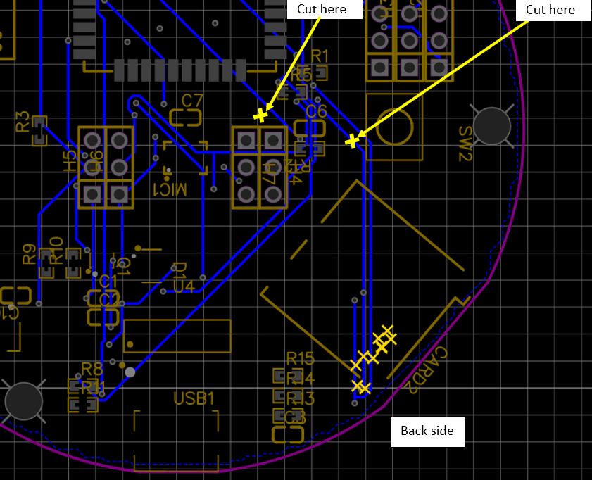
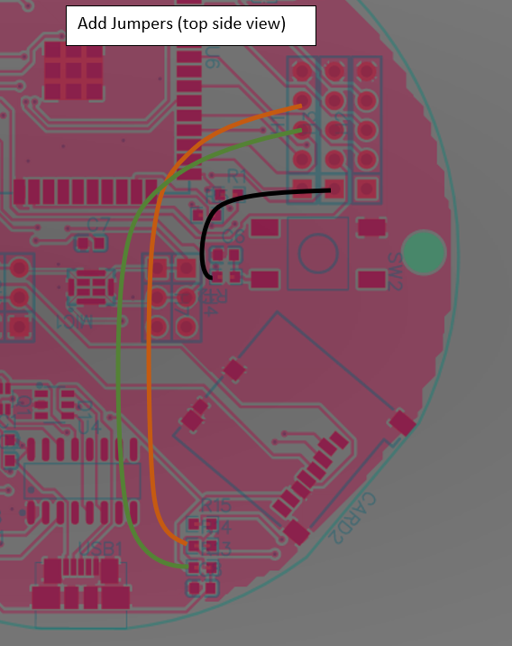

**Circuit Board design using ESP-32 WROOM with MEMS i2s microphone**

The circuit board was designed using [EasyEDA](https://www.EasyEDA.com/) and the parts were selected from what was available at JLCPCB.  The intent is that all of the parts will be surface mount except for the headers which will be through hole and optional.  [JLCPCB](https://jlcpcb.com/) will do single sided SMT assembly and only charge for the price of the components.

The schematic includes headers which were added to provide the ability to cut out the built-in microphone and built-in piezo buzzer.

For the PCB layout, the microphone uses a PDM interface.  I ordered 5 boards on 8/21/2021.  Boards will come with all SMT parts installed.  The only parts not installed are the pin headers which were added to provide cut/jumper options for the microphone and buzzer as well as access to all of the other GPIOs.  A built-in LED is included in the design on GPIO23.

The image of the board shows all of the components, note the ordered boards will not have the through-hole pin headers installed.   

To Do:
1. Verify thinner traces (0.1mm) work with built-in PDM microphone  --> Complete - I was able to get it to work.
2. Verify interface for PDM microphone.  Backup is to use install a header and use an external microphone.  --> Complete - I was able to get it to work.
3. Figure out why 3D model (obj and stl) of board shows odd effect in line with the USB-to-UART converter

Board design from 8-21-21 requires some modifications to make it work.

Once these modifications are made, the following pins will be used:
SW2 (button just above SD card interface) - GPIO19

SD Card

>  PIN_NUM_MISO GPIO_NUM_16
>  PIN_NUM_CLK GPIO_NUM_14
>  PIN_NUM_MOSI GPIO_NUM_17
>  PIN_NUM_CS GPIO_NUM_13
	
Microphone

>  I2S_MIC_CHANNEL I2S_CHANNEL_FMT_ONLY_RIGHT
>  I2S_MIC_SERIAL_CLOCK GPIO_NUM_26
>  I2S_MIC_LEFT_RIGHT_CLOCK GPIO_NUM_25
>  I2S_MIC_SERIAL_DATA GPIO_NUM_27

Also for microphone, you will need the following settings:

>i2s_config_t i2s_mic_Config = {
>    .mode = (i2s_mode_t)(I2S_MODE_MASTER | I2S_MODE_RX | I2S_MODE_PDM),
>    .sample_rate = SAMPLE_RATE,
>    .bits_per_sample = I2S_BITS_PER_SAMPLE_32BIT,
>    .channel_format = I2S_MIC_CHANNEL, 
>    .communication_format = i2s_comm_format_t(I2S_COMM_FORMAT_I2S | I2S_COMM_FORMAT_I2S_MSB), 
>    .intr_alloc_flags = ESP_INTR_FLAG_LEVEL1,
>    .dma_buf_count = 4,
>    .dma_buf_len = 1024,
>    .use_apll = false,
>    .tx_desc_auto_clear = false,
>    .fixed_mclk = 0};

