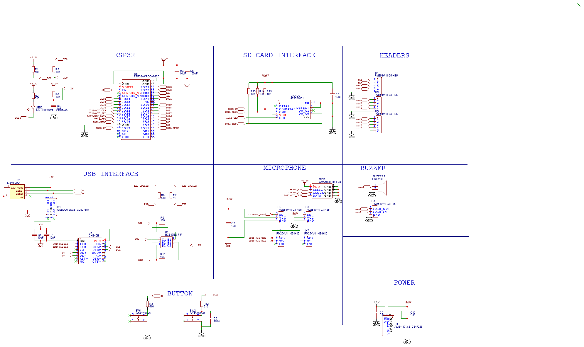

**Circuit Board design using ESP-32 WROOM with MEMS i2s microphone**

The circuit board was designed using [EasyEDA](https://www.EasyEDA.com/) and the parts were selected from what was available at JLCPCB.  The intent is that all of the parts will be surface mount except for the headers which will be through hole and optional.  [JLCPCB](https://jlcpcb.com/) will do single sided SMT assembly and only charge for the price of the components.

The schematic includes headers which were added to provide the ability to cut out the built-in microphone and built-in piezo buzzer.

.

For the PCB layout, the microphone uses a PDM interface.  I ordered 5 boards on 8/21/2021.  Boards will come with all SMT parts installed.  The only parts not installed are the pin headers which were added to provide cut/jumper options for the microphone and buzzer as well as access to all of the other GPIOs.  A built-in LED is included in the design on GPIO23.

A [3d model](HeyRickover-3D Model.obj) of the board shows all of the components, note the ordered boards will not have the through-hole pin headers installed.

To Do:
1. Verify thinner traces (0.1mm) work with built-in PDM microphone
2. Verify interface for PDM microphone.  Backup is to use install a header and use an external microphone.
