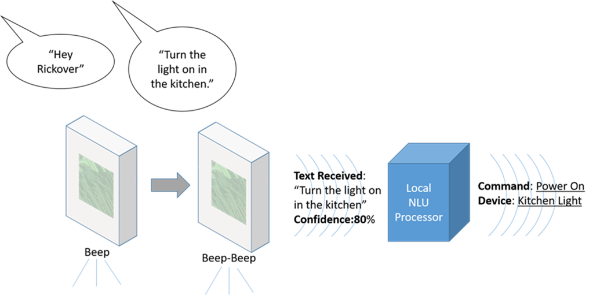
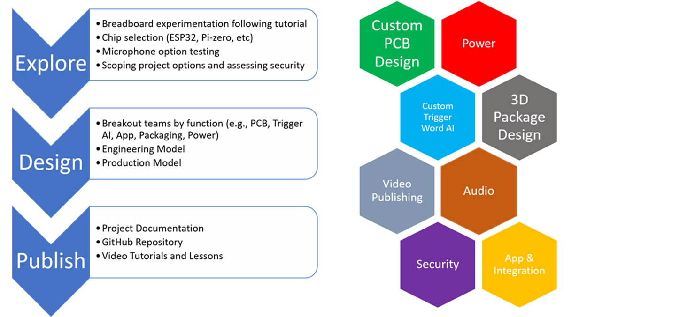

# HEY RICKOVER PROJECT GIT

The is the git repository for the Hey Rickover Project. This is a work in progress to explore Atomic14's awesome DIY Alexa example and look for ways to remove cloud/internet dependency further (e.g., eliminate Wit.ai) and play with developing harware to make a custom low cost device. Below is the initial project announcement/invitation. The code files above are structured top split the work into different areas of interest (aligned to the project sections described below). Each folder should have a README.md file to help people get started from "bare metal" and learn about that part of the project.  

# Initial Project Overview:

Inviting you and anyone interested to join a project team and contribute to a fun development project called “Hey Rickover”.  Summary of the why/what is below. If you have questions or would like to join send me a note.  After this initial invite all communications will be done in a Slack workspace that we’ll set up for team communications and collaboration – so please tell me if you want to be invited to our Slack Workspace. (For those of you who have already told me you want to join please send me an email address to use for Slack if you haven’t already done so.) Joining us in Slack doesn’t commit you to do anything – but we’ll probably end up using that space/app for future projects as well – so I encourage you to come check it out.  We’ll have various channels setup for the different aspects of development. You can also contact me via personal email.  This is intended to be a fun at home project with most of the work done after hours.

This project is certainly feasible – here is a video tutorial of something that is almost exactly what we are looking for.  Maybe we don’t need a speaker; we certainly need a cool package and PCB; and we would prefer to not use Wit.ai as an interpreter to keep our home automation out of the cloud – but who knows.  Anyway we’ve got a lot of stuff in the DIY space to start from and can focus on optimizing our design and making it fit our specific needs and then packaging the results just in time for holiday shopping (what a great gift idea!!).   

**Baseline Tutorial:** https://www.youtube.com/watch?v=re-dSV_a0tM

**Project General Goal:**  Building a device to capture voice commands for use in home automation that does not rely on any internet services.

**Use Case:** Enable affordable voice control at home without privacy/security concerns associated internet based commercial services like Google Home (Hey Google), Amazon Echo (Alexa), or Apple Homekit (Hey Siri).

.

**Learning Goals/Topics:** Home Automation Platforms, Artificial Intelligence (trigger word detection and natural language understanding), Software Development and Programming, Communication Protocols, Control System and Network Security, Lightweight Processors and “Internet of Things (IoT)”, Printer Circuit Board design and Manufacturing, Audio Processing, 3D printing and Computer Aided Design for Additive Manufacturing, Open Source Applications, Developing Tutorials and Video Content.

# Specific Project Goals:

*--Cost:* Targeting <$15 to make each device (case, parts, etc); minimize the labor to assemble and program – but labor costs can be excluded.  Stretch goal: Include AC-DC power conversion hardware in cost (otherwise rely on a USB adapter being provided).

*--Internet Independence:*  Each device should be able to detect a customizable trigger (“Hey Rickover”) and then capture and transmit text from the following voice command.  The trigger word detection and voice-to-text transcoding shall occur on the device itself. Stretch goal: Include Natural Language Understanding (figure out what a user intends) detection in on-premises device/server (in lieu of using Wit.ai or other cloud service).

*--Power:* Device is designed to listen so should be light and allowing “hanging” off any 120V outlet – either hooked onto USB wall adapter or using its own plug.  Stretch goal: include low-cost and high efficiency (>85%) power conversion from 120V AC.

*--Device Output:* The device will provide text commands as output to be interpreted and used by home automation systems.  Stretch Goal: Devices could determine “quality” (loudness/accuracy measures) and negotiate with other devices to deconflict audio commands heard by multiple devices so only one version of what is heard is passed on.

*--System Output:* A server (Raspberry Pi, virtual machine, etc) should determine the intent (Natural Language Understanding (NLU)) and translate natural speech into machine executable commands. Stretch Goal:  Do NLU on the device itself.

# Project Areas and Phases:
**You don’t need to know it all or do it all.  The project will need people to work in small teams (and team leaders) to explore and then deliver in different areas.  The following are expected project areas and stages of development.  You are free to jump in or out and contribute however best suits you.**

.

# Topics for Early Exploration and Likely Tasks in Project Areas:

**Electronic Design/Manufacturing:** 

--Microprocessor Selection – choosing the core platform based on cost/capability/reliability/power-consumption (e.g., Pi-Zero, ESP32, etc).

--Should we make a simple PCB and solder in/on selected parts?  Should we design a PCB and have a manufacturer assemble the whole board including component placement and soldering?

--Select PCB design tools

**Power:**

--Should we assume user provided wall-adapters (impacts case design – need to hang off of USB; impacts efficiency and product value)?

--Should we use our expertise in power electronics and make a high-efficiency/low-cost converter and plug the device in directly?

--Measure efficiency and power consumption – what are reasonable design goals for designing power conversion into device (cost, efficiency, etc)?

**Audio:**

--Microphone selection – I2S output from a MEMs mic seems like the best option – but are there other choices? Integrated board or just the mic in our own custom circuit?

--Should we provide speaker for device response?  Or simple buzzer (piezo speaker) to “beep” and acknowledge trigger-word and end of recording a command.

--Provide input to package/case design team to ensure good sounds pickup and sensitivity.

Trigger Word Detection and Voice to Text Capture:

--This will be done on the device we build directly; but training a lightweight AI model with an uncommon trigger word may be hard.  Should we use something other than “Hey Rickover”?

--Select software and approach for light-AI-framework to detect trigger word on low cost IoT microprocessors.

--Developing work flow and nodal network to allow high accuracy custom trigger-word detection.

**Natural Language Understanding (NLU):**

--Investigate options for NLU AI-frameworks to convert transcribed human sentences to intended actions (e.g., Wit.ai, RASA, Snips, Almond, etc).

--Goal is all on-premises (local devices on your home network) without reliance on cloud; but consider privacy, reliability, speed, performance of options.

--Determine feasibility of allowing user options and programmable settings to select among various NLU processors.

Software Development and App Integration:

--Select tools for work flow and team collaboration.

--Identify best practices for coding and coordinate development language choice for various system sections.

**Packaging Design:**

--Select CAD design tools for 3D printed prototyping and design collaboration (e.g., tinkercad.com, fusion 360).

--Prototype and 3D print flexible designs to hold a circuit board with or without onboard power (e.g., integrated plug or for a wall-adapter).

--Coordinate with potential users and other design teams on goals.

--Explore options for injection molding and manufacturing final product vs posting 3D model for DIY manufacturing with 3D printers.

**Security:**

--Explore vulnerabilities in fundamental design.

--Suggest security enhancements in system that balance availability, confidentiality, and integrity of system and data.

--Explore vulnerabilities in design process and our “vendor base”.

**Documenting and Publishing:**

--Plan out how to publish tutorials and share lessons learned across all areas.

--Produce videos, websites, etc.

--Decide if the final product should be made available for purchase at cost.

--Provide input on any “branding” logos, etc.

**Home Automation Integration:**

--Develop the baseline “use case” to share as an example.

--Work across the team to help integrate the device into different home-automation environments.

--Provide support, capture best practices, and feedback improvement needs for product design to make it easier to use and more flexible.
